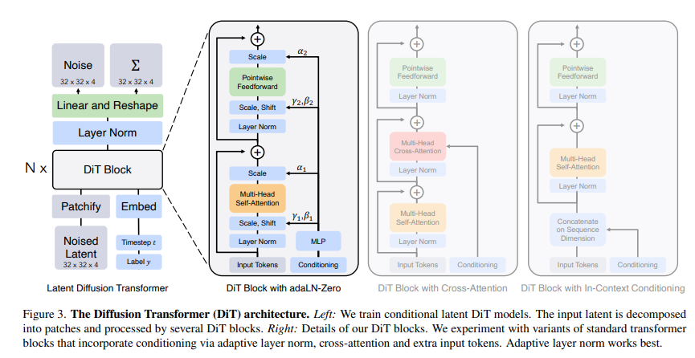

# LDM Latent Diffusion Model

### 可能的生成流程干涉方法

- PuLID 会提取参考图像中的身份特征，并在生成过程中将这些信息注入到潜在表示中。
- 在原有的扩散流程中增加一个额外的分支（例如 Lightning T2I 分支），通过对比对齐技术和额外的 ID 损失，进一步确保图像细节（例如面部特征）与参考图像保持一致，从而减少原始模型行为被干扰的可能。
- 在生成器（例如用于去噪的 U-Net）中，将身份向量作为额外的条件输入。通常，这个向量可以与噪声向量在某些层进行拼接或通过线性变换后进行相加
- 在一些模型中，会利用交叉注意力层来将身份特征“对齐”到潜在表示上。这里，身份向量作为“键”或“值”参与注意力计算。

### VAE Variational AutoEncoder

VAE（变分自编码器，Variational Autoencoder）：是一种生成模型，它通过编码器将数据映射到一个概率分布的 Latent Space，再通过解码器生成新的数据，使得生成的数据更具**连贯性和多样性**。

---

### **1. Latent Space（潜在空间）**

Latent Space（潜在空间）是将高维数据（如图像、文本）转换为低维的向量表示，同时保留数据的关键特征。

- 在图像生成任务中，不同的人脸可以映射到一个潜在空间点，而这个点的变化会导致脸部特征（如年龄、表情）的变化。
- 在 NLP 任务中，语义相近的句子可能会有相似的潜在表示。

在低维数据中进行数据处理可以提高计算效率。  
在潜在空间进行操作（如插值、采样），可以生成新的数据。  
潜在空间可以学到数据的核心结构，例如在人脸数据中，可能有一条“年龄”方向或“微笑”方向。

---

### **2. VAE（Variational Autoencoder，变分自编码器）**

VAE 是一种基于 **Autoencoder（自编码器）** 的生成模型，可以学习潜在空间的概率分布，从而生成数据。

#### **(1) VAE 结构**

- **编码器（Encoder）**：将输入数据 $ x $ 映射到潜在空间 $ z $，但是不同于普通自编码器，它学习的是**一个分布**（均值 $ \mu $ 和方差 $ \sigma^2 $），而不是一个固定的点：
  $$
  q(z | x) = \mathcal{N}(\mu, \sigma^2)
  $$
- **解码器（Decoder）**：从潜在空间的采样点 $ z $ 生成数据 $ x' $，即：
  $$
  p(x | z)
  $$

#### **(2) 为什么 VAE 需要分布（而不是普通自编码器）？**

普通的 Autoencoder 只学习一个确定的潜在表示 $ z $，而 VAE 通过学习分布 $ \mathcal{N}(\mu, \sigma^2) $，使潜在空间更加平滑和连贯，从而具备更强的生成能力。例如：

- **普通 Autoencoder**：输入数据点 A 和 B 会被编码到潜在空间的两个点 $ z_A $ 和 $z_B $，但它们之间的区域可能没有意义（无法解码为真实数据）。
- **VAE**：输入 A 和 B 会被编码到两个高斯分布，解码器学习从这些分布中采样，确保潜在空间的不同区域都能生成有意义的数据。

#### **(3) 训练目标**

VAE 的损失函数由两部分组成：

- **重构损失（Reconstruction Loss）**：保证解码器能够尽可能还原输入数据。
  $$
  \mathbb{E}_{q(z|x)} [ \log p(x|z) ]
  $$
- **KL 散度（KL Divergence）**：确保潜在变量 $ z $ 接近标准正态分布（$ \mathcal{N}(0, I) $）。
  $$
  D_{KL}( q(z | x) || p(z) )
  $$

最终的目标是 **最小化总损失**：

$$
L = \mathbb{E}_{q(z|x)} [ \log p(x|z) ] - D_{KL}( q(z | x) || p(z) )
$$

---

### **3. VAE 的作用**

**VAE** 通过编码数据到概率分布，使得潜在空间更加平滑，能够生成新数据，并有效进行数据插值。适用于图像生成、风格迁移、异常检测等任务。

1. **数据生成**：可以生成类似于训练数据的新样本（如人脸、手写数字）。
2. **数据插值**：在潜在空间中插值，可以实现风格迁移或平滑变化，如让一张脸逐渐变老。
3. **降噪与特征学习**：VAE 具有 Autoencoder 的特性，可以用来学习数据的核心特征。

---

VAE 模型结构示例：

```python
import torch
import torch.nn as nn
import torch.nn.functional as F

class VAE(nn.Module):
    def __init__(self, input_dim=784, hidden_dim=400, latent_dim=20):
        super(VAE, self).__init__()
        # 编码器部分：将输入映射到隐藏层，再映射到潜在空间的均值和对数方差
        self.fc1 = nn.Linear(input_dim, hidden_dim)
        self.fc_mu = nn.Linear(hidden_dim, latent_dim)      # 均值
        self.fc_logvar = nn.Linear(hidden_dim, latent_dim)  # 对数方差

        # 解码器部分：将采样的潜在变量映射回原始数据空间
        self.fc2 = nn.Linear(latent_dim, hidden_dim)
        self.fc3 = nn.Linear(hidden_dim, input_dim)

    def encode(self, x):
        h1 = F.relu(self.fc1(x))
        mu = self.fc_mu(h1)
        logvar = self.fc_logvar(h1)
        return mu, logvar

    def reparameterize(self, mu, logvar):
        # 使用重参数化技巧进行采样，保证网络可微分
        std = torch.exp(0.5 * logvar)
        eps = torch.randn_like(std)
        return mu + eps * std

    def decode(self, z):
        h2 = F.relu(self.fc2(z))
        return torch.sigmoid(self.fc3(h2))

    def forward(self, x):
        # 展平输入，并编码为潜在变量参数
        mu, logvar = self.encode(x.view(-1, 784))
        # 采样潜在变量
        z = self.reparameterize(mu, logvar)
        # 解码得到重构结果
        recon_x = self.decode(z)
        return recon_x, mu, logvar
```

### 代码说明

1. **编码器部分**

   - 输入数据通过 `fc1` 全连接层映射到隐藏层，并使用 ReLU 激活函数。
   - 隐藏层的输出分别通过 `fc_mu` 和 `fc_logvar` 得到潜在空间的均值 $ \mu $ 和对数方差 $ \log \sigma^2 $。

2. **重参数化采样**

   - 通过 `reparameterize` 函数，将 $ \mu $ 和 $ \log \sigma^2 $ 转换为标准差，并利用随机噪声 $ \epsilon $ 进行采样，得到潜在变量 $ z = \mu + \sigma \cdot \epsilon $。
   - 这一操作使得采样过程保持可微，从而支持反向传播。

3. **解码器部分**

   - 潜在变量 $ z $ 经过 `fc2` 全连接层和 ReLU 激活，再通过 `fc3` 全连接层映射回原始数据空间，最后使用 Sigmoid 激活函数（适用于像 MNIST 这种归一化到 [0,1] 的数据）。

4. **前向传播**
   - 在 `forward` 函数中，首先对输入数据进行展平处理，然后依次执行编码、采样和解码操作，最终输出重构结果以及潜在变量参数 $ \mu $ 和 $ \log \sigma^2 $。

# Diffusion Transformer

这是一个基于 Latent Diffusion Model 的扩散性图象生成模型，取代了原先 Stable Diffusion 中的 UNet 部份,此方法基本脱胎于 Vision Transformer。调整了其中的 Layer Norm 部份，用 Adaptive Layer Norm 取代了原来的 Layer Norm。[论文链接](https://arxiv.org/abs/2212.09748)



## SPE

**总结：**

**SPE（Sinusoidal Positional Encoding）** 是在 Transformer 等模型中使用的位置编码方法，用于给模型提供 **序列中每个位置的信息**。  
它的作用是让模型在没有循环结构（如 RNN）或卷积结构（如 CNN）的情况下，能够感知输入序列中各个元素的**位置信息**。

---

**详细解释：**

### 🧠 为什么需要 Positional Encoding？

Transformer 自身不具备处理序列顺序的能力（不像 RNN 有时间步概念）。  
所以我们需要显式地告诉模型：**“第 1 个词、第 2 个词……它们在句子中的位置不同。”**

---

### 🔢 SPE 的原理

SPE 使用不同频率的正弦和余弦函数来为每个位置生成唯一的向量。  
对某个位置 $ pos $ 和维度 $ i $，其编码方式如下：

$$
\text{PE}_{(pos, 2i)} = \sin\left(\frac{pos}{10000^{2i/d_{model}}}\right)
$$

$$
\text{PE}_{(pos, 2i+1)} = \cos\left(\frac{pos}{10000^{2i/d_{model}}}\right)
$$

- $ pos $：序列中的位置（第几个词）
- $ i $：编码维度的索引
- $ d\_{model} $：模型的嵌入维度（如 512）

这种设计让编码具有以下特性：

- **平滑变化**：相邻位置的编码相似，有助于学习局部关系
- **可以外推**：模型能推广到比训练时更长的序列

# RPE Rotation Positional Encoding

旋转位置编码，在 Flux 的 transformer 模块中使用：

```python
class FluxPosEmbed(nn.Module):
  def __init__(self, theta: int, axes_dim: List[int]):
    super().__init__()
    self.theta = theta
    self.axes_dim = axes_dim
  def forward(self, ids: torch.Tensor) -> torch.Tensor:
    n_axes = ids.shape[-1]
    cos_out = []
    sin_out = []
    pos = ids.float()
    for i in range(n_axes):
      cos, sin = get_1d_pos_embed(
        self.axes_dim[i],
        pos[:, i],
        theta=self.theta
        repeat_interleave_real=True,
        use_real=True,
        freqs_dtype = torch.float32
      )
      cos_out.append(cos)
      sin_out.append(sin)
    freqs_cos = torch.cat(cos_out, dim=-1).to(ids.device)
    freqs_sin = torch.cat(sin_out, dim=-1).to(ids.device)
    return freqs_cos, freqs_sin

def get_1d_pos_embed(
    dim: int,
    pos: Union[np.ndarray, int, torch.Tensor],
    theta: float = 10000.0,
    linear_factor=1.0,
    ntk_factor=1.0,
    repeat_interleave_real: bool = True,
    use_real: bool = False,
    freqs_dtype: torch.dtype = torch.float32
) -> Tuple[torch.Tensor, torch.Tensor]:
    """
    获取一维位置编码
    """
    if isinstance(pos, int):
        pos = torch.arange(pos)
    elif isinstance(pos, np.ndarray):
        pos = torch.from_numpy(pos)

    theta = theta * ntk_factor
    freqs = (
      1.0
      / (theta ** (torch.arange(0, dim, 2, dtype=freqs_dtype, device=pos.device)[:(dim//2)] / dim))
      / linear_factor
    )

    freqs = torch.outer(pos, freqs)
    if use_real and repeat_interleave_real:
      freqs_cos = freqs.cos().repeat_interleave(2, dim=-1, output_size=freqs.shape[1]*2).float()
      freqs_sin = freqs.sin().repeat_interleave(2, dim=-1, output_size=freqs.shape[1]*2).float()
      return freqs_cos, freqs_sin
    elif use_real:
      freqs_cos = torch.cat([freqs.cos(), freqs.cos()], dim=-1).float()
      freqs_sin = torch.cat([freqs.sin(), freqs.sin()], dim=-1).float()
      return freqs_cos, freqs_sin
    else:
      freqs_cis = torch.polar(torch.ones_like(freqs), freqs)
      return freqs_cis
```
