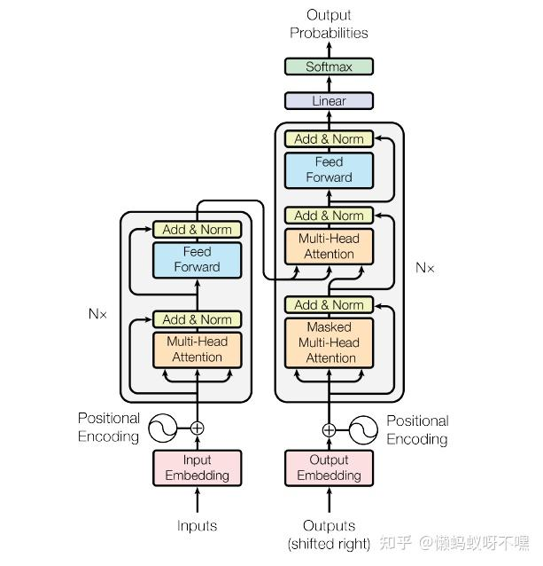

# Transformer

## 总体结构



## 1. Tokenizer

1. 分词：\
   tokenizer 将字符串分为一些 sub-word token string，再将 token string 映射到 id，并保留来回映射的 mapping。从 string 映射到 id 为 tokenizer encode 过程，从 id 映射回 token 为 tokenizer decode 过程。映射方法有多种，例如 BERT 用的是 WordPiece，GPT-2 和 RoBERTa 用的是 BPE 等等，后面会详细介绍。
2. 扩展词表：\
   部分 tokenizer 会用一种统一的方法将训练语料出现的且词汇表中本来没有的 token 加入词汇表。对于不支持的 tokenizer，用户也可以手动添加。
3. 识别并处理特殊 token:\
   特殊 token 包括 MASK, <|im_start|>, 等等。tokenizer 会将它们加入词汇表中，并且保证它们在模型中不被切成 sub-word，而是完整保留。

最常用的、介于两种方法之间的分词法叫子词分词法，会把上面的句子分成最小可分的子词'To', 'day', 'is', 'S', 'un', 'day'。子词分词法的好处是可以避免 OOV（Out Of Vocabulary）问题，即在训练语料中没有出现过的单词。子词分词法的原理是将一个单词拆分成多个子词，然后将这些子词映射到一个固定大小的词汇表中。这样就可以避免 OOV 问题，因为即使一个单词没有出现在训练语料中，它也可以被拆分成多个子词，这些子词可能在训练语料中出现过。子词分词法有很多不同取得最小可分子词的方法，例如 BPE（Byte-Pair Encoding，字节对编码法），WordPiece，SentencePiece，Unigram 等等

### BPE（Byte-Pair Encoding）

GPT-2 开始一直到 GPT-4，openAI 都使用 BPE 分词法。算法步骤如下：

> 1. 统计输入中所有出现的单词并在每个单词后加一个单词结束符</w> -> ['hello</w>': 6, 'world</w>': 8, 'peace</w>': 2]
> 2. 将所有单词拆成单字 -> {'h': 6, 'e': 10, 'l': 20, 'o': 14, 'w': 8, 'r': 8, 'd': 8, 'p': 2, 'a': 2, 'c': 2, '</w>': 3}
> 3. 合并最频繁出现的单字(l, o) -> {'h': 6, 'e': 10, 'lo': 14, 'l': 6, 'w': 8, 'r': 8, 'd': 8, 'p': 2, 'a': 2, 'c': 2, '</w>': 3}
> 4. 合并最频繁出现的单字(lo, e) -> {'h': 6, 'lo': 4, 'loe': 10, 'l': 6, 'w': 8, 'r': 8, 'd': 8, 'p': 2, 'a': 2, 'c': 2, '</w>': 3}
> 5. 反复迭代直到满足停止条件
>    显然，这是一种贪婪的算法。在上面的例子中，'loe'这样的子词貌似不会经常出现，但是当语料库很大的时候，诸如 est，ist，sion，tion 这样的特征会很清晰地显示出来。

在获得子词词表后，就可以将句子分割成子词了，算法见下面的例子：

```c
# 给定单词序列
["the</w>", "highest</w>", "mountain</w>"]

# 从一个很大的corpus中排好序的subword表如下
# 长度 6         5           4        4         4       4          2
["errrr</w>", "tain</w>", "moun", "est</w>", "high", "the</w>", "a</w>"]

# 迭代结果
"the</w>" -> ["the</w>"]
"highest</w>" -> ["high", "est</w>"]
"mountain</w>" -> ["moun", "tain</w>"]
```

因为存在大量的 if-else 语句，所以 BPE 基本无法并行化。为了加速分词，HuggingFace 的 tokenizer 使用了 Rust 语言实现的分词器，速度比 Python 快了 100 倍。

### Word-Piece

Word-Piece 和 BPE 非常相似，BPE 使用出现最频繁的组合构造子词词表，而 WordPiece 使用出现概率最大的组合构造子词词表。换句话说，WordPiece 每次选择合并的两个子词，通常在语料中以相邻方式同时出现。比如说 P(ed) 的概率比 P(e) + P(d)单独出现的概率更大（可能比他们具有最大的互信息值），也就是两个子词在语言模型上具有较强的关联性。这个时候，Word-Piece 会将它们组合成一个子词。

另外 BERT 在使用 Word-Piece 时，使用一些特殊 token 来表示一些特殊的词，例如[UNK]表示未知的 token，[CLS]表示分类 token 加在段落最前面，[SEP]表示分隔符 token，加在段落\句子末尾。

## 2. Input Embedding

Input Embedding 将输入的单词序列转换为向量序列。每个单词通过一个嵌入矩阵（Embedding Matrix）映射到一个高维空间中。这个嵌入矩阵是一个可学习的参数，随着模型的训练而更新。

具体过程如下：

1. 将输入的单词序列转换为 token ID 序列。token ID 是一个高维稀疏 one-hot 向量，每一位表示一个单词在词汇表中的索引。
2. 将 token ID 序列通过嵌入矩阵映射到一个高维空间中，得到一个稠密的向量序列。这个嵌入矩阵是一个可学习的参数，随着模型的训练而更新。

```python

class Embedding(nn.Module):
    def __init__(self, vocab_size, hidden_size):
        super().__init__()
        self.lut = nn.Embedding(vocab_size, hidden_size)
        self.scale = hidden_size ** 0.5

    def forward(self, x):
        return self.lut(x) * self.scale
```

## 3. Positional Encoding

Positional Encoding 是 Transformer 模型中用于表示单词在句子中的位置信息的机制。由于 Transformer 模型没有循环结构，因此需要一种方法来捕捉单词之间的顺序关系。Positional Encoding 通过将位置信息添加到输入嵌入中来实现这一点。
公式如下：

$$
PE(pos,2i)=\sin(\frac{pos}{10000^{2i/d}})\\
PE(pos,2i+1)=\cos(\frac{pos}{10000^{2i/d}})
$$

```python
class PositionalEncoding(nn.Module):
    def __init__(self, config):
        super().__init__()
        pos= torch.arange(0,config.max_position_embedding).unsqueeze(1)
        div_term=1000**(-torch.arange(0,config.hidden_size,2)/config.hidden_size)

        pe= torch.zero(config.max_position_embedding, config.hidden_size)
        pe[:,1::2] = torch.sin(pos*div_term)
        pe[:,0::2] = torch.cos(pos*div_term)
        pe=pe.unsqueeze(0) # [1, max_len, d]

        self.register_buffer("pe", pe)

    def forward(self, x: Tensor) -> Tensor:
        """
        Args:
            x : shape [bz, len, d]
        """
        return x + self.pe[:, : x.size()[1]]
```

## 4. Multi-Head Attention

Transformer 的核心模块:

$$
Attention(Q,K,V)=softmax(\frac{QK^T}{\sqrt{d_K}})V
$$

```python
def attention_forward(module,query,key,value,scaling,dropout,mask):
    atten_weights = torch.matmul(query,key.transpose(-1,-2))*scaling
    if mask is not None:
        atten_weights.maked_fill_(mask,float("-inf"))
    atten_weights = torch.softmax(atten_weights,dim=-1)
    atten_weights = F.dropout(atten_weights, p=dropout, training=module.training)
    atten_output = torch.mutmul(atten_weights, value)
    return atten_output
```

在 Transformer 计算存在两种类型的 mask，这里沿用 torch.nn.Transformer 中的名称，分别为 key_padding_mask 和 attn_mask。

```python
class MultiHeadAttention(nn.Module):
    def __init__(self,config):
        super().__init__()
        self.head_num=config.head_num
        self.head_size=config.head_size
        self.all_head_size=self.head_num * self.head_size
        self.scaling = self.head_size**0.5
        self.attention_drop=config.attention_drop

        self.Q=torch.Linear(config.hidden_size,self.all_head_size,bias=config.qkv_bias)
        self.K=torch.Linear(config.hidden_size,self.all_head_size,bias=config.qkv_bias)
        self.V=torch.Linear(config.hidden_size,self.all_head_size,bias=config.qkv_bias)

        self.linear=nn.Linear(self.all_head_size,config.hidden_size)

        self.dropout = nn.Dropout(config.hidden_dropout)

    def transpose_for_scores(self, x):
        """
            x: shape [bz, len, h*d]
        """
        new_size = x.size()[:2] + (self.head_num, self.head_size)
        x.view(new_size) # [bz, len, h, d]

        return x.permute(0,2,1,3)  # [bz, h, len, d]

    def forward(self, q, k, v, key_padding_mask, attn_mask):
        q = self.tranpose_for_scores(self.Q(q))
        k = self.tranpose_for_scores(self.K(k))
        v = self.tranpose_for_scores(self.V(v))

        mask=self.merge_masks(key_padding_mask,attn_mask)
        output=atten_forward(self,q,k,v,self.scaling,
            dropout=0.0 if not self.training else self.dropout,
            mask=attn_mask)
        # [bz, h, len, d]
        output=output.transpose(1,2).contiguous() # [bz,len,h,d]
        output=output.reshape(output.size()+(self.all_head_size,)) #[bz,len,h*d]

        output=self.linear(output)
        output=self.dropout(output)

        return output
```

**Key padding mask**

key_padding_mask 比较容易理解，在前文中，为了解决同一个 batch 中样本长度不一致的问题，会在较短的序列末尾多个填充 '<PAD>' 字符。这一字符并没有实际的语义信息，因此本质上不应该参与 attention 计算。

实践中我们只对 Key 做 mask，因为 Query 的计算可以在后续损失函数中指定 ignore index 来忽略<PAD>这一 query。而在推理阶段，对于 src 文本，encoder 中的 '<PAD>' query 对应计算出的特征，会在 decoder 中作为 key，进而使用 key_padding_mask 掩盖。而 tgt 是逐字生成的，遇到 '<SEP>' 就会停止，不会填充 '<PAD>'。

**Attention Mask**

attn_mask 主要用于 decoder 中的 self-attention 计算，其目的是确保模型训练时只能看到当前和过去的信息，避免未来信息泄露。例如，将 'I love you' 翻译为 '我爱你' 这一过程，decoder 的翻译流程是，已知 <CLS> 起始标记，预测 '我'；已知 '<CLS>我' ，预测 '爱'；已知 '<CLS>我爱'，预测 '你'；已知 '<CLS>我爱你'，预测 '<SEP>'；翻译结束。

然而，在训练过程中，我们通过 shifted right 操作实现了并行训练，当输入 query 是 '<CLS>'时，已经能够在 key 中看到完整的 '<CLS>我爱你' 了！这很明显变成了已知未来，预测未来，出现了信息泄露。为避免这一情况，需要使用 attn_mask 对未来信息进行掩盖。

**Mask merge**

mask 作用在 [bz,h,q_dim,k_dim] 矩阵上。对于维度为 [bz, k_dim] 的 key padding mask 要扩展到四维 [bz,h,1,k_dim] ,在第三个维度直接 copy 得到 [bz,h,q_dim,k_dim] 。对于维度为 [q_dim, k_dim] 的 attn_mask，因为只用于 self attention 所以 q_dim=k_dim。扩展后直接在第一、第二维度进行复制得到 [bz,h,q_dim,k_dim]。

```python
def merge_mask(self, key_padding_mask, attn_mask):
    if key_padding_mask is None and attn_mask is None:
        return None
    mask = None
    if key_padding_mask is not None:
        bz, k_dim=key_padding_mask.shape
        key_padding_mask=key_padding_mask.view(bz,1,1,k_dim).expand(-1,self.head_num,-1,-1)

        mask=key_padding_mask
    if attn_mask is not None:
        dim=attn_mask.shape[0]
        attn_mask=attn_mask.view(1, 1, dim, dim).expand(bz, self.head_num, -1,-1)

        if mask is None:
            mask = attn_mask
        else:
            mask = mask.logical_or(attn_mask)
    return mask
```

### Mask 设置

(1) src attention：属于 self-attention，q, k, v 都来自 src (即 Inputs)

- key_padding_mask：由于 key 来自 src，所以使用 batch 中 Inputs 的 padding_mask，尺寸为 [bz, len_src] 。
- attn_mask：因为 src 是已知的文本，不需要预测，因此不需要使用下三角 mask 来屏蔽信息，为 None。

(2) tgt attention：属于 self-attention，q, k, v 都来自 tgt (即 Outputs)

- key_padding_mask：由于 key 来自 tgt，所以使用 batch 中 Outputs 的 padding_mask，尺寸为 [bz, len_tgt]。
- attn_mask：因为 tgt 本身是需要预测的文本，所以要使用下三角 mask 屏蔽未来信息，尺寸为 [len_tgt, len_tgt]。

(3) memory attention：属于 cross-attention，q 来自 tgt，k, v 来自 src

- key_padding_mask：由于 key 来自 src，所以使用 batch 中 Inputs 的 padding_mask，尺寸为 [bz, len_src] 。
- attn_mask：因为 key 来自已知的 src，所以 tgt 中每个 query 都可以看到所有的 key，不需要屏蔽信息，为 None 对于

## Feed Forward Networks

前馈神经网络，由两个 Linear 组成，中间使用 ReLU 激活，最后 dropout。中间进行升维后降维。

```python
class FeedForwardNetworks(nn.Module):
    def __init__(self,config):
        super().__init__()

        self.linear1=nn.Linear(config.hidden_size,config.intermediate_size)
        self.linear2=nn.Linear(config.intermediate_size,hidden_size)

        self.dropout=nn.Dropout(config.hidden_dropout)

    def forward(self,x):
        x=self.linear1(x)
        x=F.relu(x)
        x=self.linear2(x)
        x=self.dropout(x)
        return x
```

前馈神经网络在 transformer 中的主要作用是引入了非线性运算（attention 部份虽然由 softmanx，但是只对 Q、K 进行了 softmax，实际上对 V 仍是线性加权和）。另外，有研究认为 FFN 作为 transformer 中进行信息提取和记忆的部份。

## Layer Normalizaiton

层归一化用于对 hidden 维度进行归一化。在 transformer 和其他 RNN 中，由于输入数据和推理时数据长度不一，不同句子同一位置的分布情况和语义差异显著，使用 Batch Normal 进行归一化可能并无意义。

```python
class LayerNormal(nn.Module):
    def __init__(self, normalized_shape, eps=1e-5):
        super().__init__()
        self.gamma=nn.Parameter(torch.ones(normalized_shape))
        self.beta = nn.Parameter(torch.zeros(normalized_shape))
        self.eps = eps

    def forward(self,x):
        mean=x.mean(dim=-1,keepdim=True)
        std=x.std(dim=-1,keepdim=True)
        x=(x-mean)/(std+self.eps)

        return x * self.gamma + self.beta

```

## Output Layer

```python
class OutputLayer(nn.Module):
    def __init__(self,config):
        super().__init__()
        self.linear=nn.Linear(config.hidden_size,config.tgt_vecab_size)

    def forward(self,x):
        return self.linear(x)
```

## 组装

### Encode

```python
class EncoderLayer(nn.Module):
    def __init__(self,config):
        super().__init__()

        self.attn=MultiHeadAttention(config)
        self.ffn=FeedForwardNetworks(config)
        self.norm1=LayerNorm(config.hidden_size)
        self.norm2=LayerNorm(config.hidden_size)

    def forward(self,src, src_key_padding_mask, src_attn_mask):
        residual=src
        x=self.attn(q=src,k=src,v=src,src_key_padding_mask,src_attn_mask)
        x+=residual
        x=self.norm1(x)
        residual=x
        x=self.ffn(x)
        x+=residual
        x=self.norm2(x)

        return x

class TransformerEncoder(nn.Module):
    def __init__(self,config):
        super().__init__()
        self.layers=nn.ModuleList([
            EncoderLayer(config) for _ in range(config.num_layers)
        ])

    def forward(self, src, src_key_padding_mask, src_attn_mask):
        x=src
        all_hidden_states=()
        for layer in self.layers:
            x = layer(x, src_key_padding_mask, src_attn_mask)
            all_hidden_states+=(x,)

        return all_hidden_states
```

## Decoder

```python
class DecoderLayer(nn.Module):
    def __init__(self,config):
        super().__init__()
        self.self_attn=MultiHeadAttention(config)
        self.norm1=LayerNorm(config.hidden_size)
        self.cross_attn=MultiHeadAttention(config)
        self.norm2=LayerNorm(config.hidden_size)
        self.ffn=FeedForwardNetwork(config)
        self.norm3=LayerNorm(config.hidden_size)
    def forward(self, tgt, memory, tgt_key_padding_mask, tgt_attn_mask,
        memory_key_padding_mask, memeory_attn_mask):

        residual=tgt
        x=self.self_attn(q=tgt,k=tgt,v=tgt, tgt_key_padding_mask,tgt_attn_mask)
        x+=residual
        x=self.norm1(x)

        residual=x
        x=self.cross_attn(q=memory,k=memory,v=x, memory_key_padding_mask, memory_attn_mask)
        x+=residual
        x=self.norm2(x)

        residual=x
        x=self.ffn(x)
        x+=residual
        x=self.norm3(x)

        return x

class TransformerDecoder(nn.Module):
    def __init__(self,config):
        super().__init__()
        self.layers=nn.ModuleList([
            DecoderLayer(config) for _ in range(config.num_layers)
        ])

    def forward(self, tgt, memory_tuple, tgt_key_padding_mask, tgt_attn_mask,
        memory_key_padding_mask, memeory_attn_mask)

        x=tgt
        for i,layer in enumerate(self.layers):
            x=layer(tgt, memory_tuple[i], tgt_key_padding_mask, tgt_attn_mask,
                memory_key_padding_mask, memeory_attn_mask)
        return x

```

## Transformer

```python
class Transformer(nn.Module):
    def __init__(self,config):
        super().__init__()

        self.src_embedding=Embedding(config.vocab_size,config.hidden_size)
        self.tgt_embedding=Embedding(config.vocab_size,config.hidden_size)
        self.pe=PositionalEncoding(config)
        self.Encoder=TransformerEncoder(config)
        self.Decoder=TransformerDecoder(config)
        self.output_layer=OutputLayer(config)

        self._init_weights()

    def _init_weights(self):
        for m in self.modules():
            if isinstance(m,nn.Linear):
                m.weight.data=nn.init.trunc_normal_(
                    m.weight.data.to(torch.float32), mean=0.0, std=0.1
                ).to(m.weight.dtype)
            elif isinstance(m, nn.Embedding):
                w.weight.data.normal_(mean=0.0,std=0.1)

    def encode(self,src, src_key_padding_mask, src_attn_mask):
        src=self.src_embedding(src)
        src=self.pe(src)
        memory=self.Encoder(src,src_key_padding_mask,src_attn_mask)
        return memory

    def decode(self, tgt, memory, memory_tuple, tgt_key_padding_mask,
        tgt_attn_mask,memory_key_padding_mask, memeory_attn_mask)

        tgt=self.tgt_embedding(tgt)
        tgt=self.pe(tgt)

        output=self.Decoder(tgt,memory, memory_tuple, tgt_key_padding_mask,
            tgt_attn_mask,memory_key_padding_mask, memeory_attn_mask)
        output=self.output_layer(output)

        return output

    def forward(self,
            src,
            tgt,
            src_key_padding_mask,
            src_attn_mask,
            tgt_key_padding_mask,
            tgt_attn_mask,
            memory_key_padding_mask,
            memory_attn_mask):

        memory=self.encode(src,src_key_padding_mask, src_attn_mask)

        output=self.decode(tgt,memory,memory, tgt_key_padding_mask,
            tgt_attn_mask,memory_key_padding_mask, memory_attn_mask)

        return output

    def inference(self,src,tgt_start_token_id,tgt_end_token_id,
        src_key_padding_mask, src_attn_mask)

        assert src.shape[0]==1
        device = src.device
        memory=self.encode(src,src_key_padding_mask,src_attn_mask)

        tgt_tokens=[tgt_start_token_id]

        for _ in range(config.max_position_embeddings):
            tgt=torch.LongTensor([tgt_tokens]).to(device)
            tgt_padding_mask=torch.zeros_like(tgt, device=device, dtype=bool)
            tgt_casual_mask = generate_causal_mask(tgt.size()[1].to(device))

            output= self.decode(
                tgt,
                memory,
                tgt_padding_mask,
                tgt_casual_mask,
                memory_key_padding_mask=src_key_padding_maks,
                memory_attn_mask=None
            )[0]
            token_id=output[-1].argmax().item()
            tgt_tokens.append(token_id)

            if token_id==tgt_end_token_id:
                break

        return tgt_tokens
```
