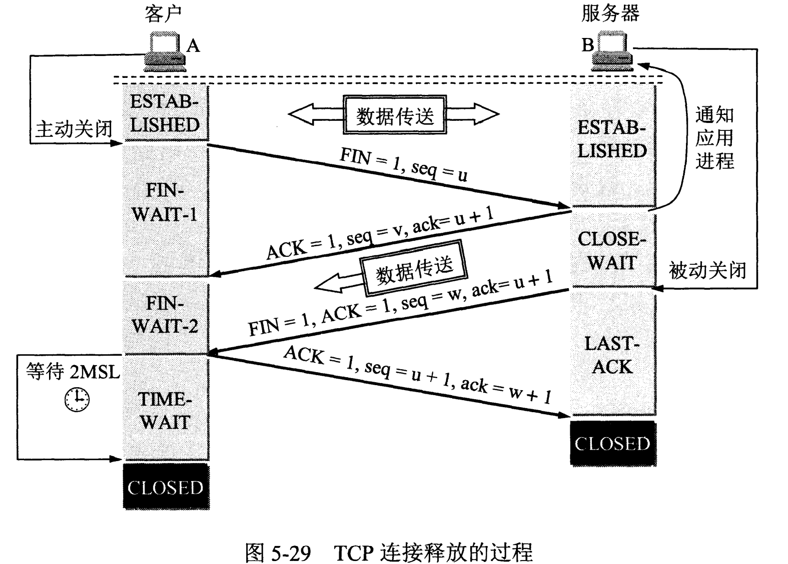

# 计算机网络

## 计算机网络体系结构

## TCP

### 什么是三次握手

三次握手是 TCP 建立连接的过程，过程如下

1. 客户端发送建立连接请求，报文头 **SYN, seq=x**，客户端进入 SYN_SENT 状态。
2. 服务端收到请求后从**LISTEN**状态进入**SYN_RCVD**(SYN Received)。发送同步-识别报文**SYN=1, ACK=1, seq=y, ack=x+1**。
3. 客户端收到同步-识别报文后发送识别报文**ACK=1, seq=x+1, ack=y+1**，客户端进入**ESTABLISHED**。
4. 服务端收到该报文后进入**ESTABLISHED**状态。
   

### 可以两次握手吗

不行，TCP 两端需要确认对方的接收能力和发送能力，两次握手无法确认其中一方的接收能力。

另外，可能会出现**已失效的连接请求报又传送到了服务器的情况**，导致服务器单方面开始连接，浪费服务器资源。

### 可以四次握手吗

可以，但是会降低传输效：

### 第三次握手中，如果客户端的 ACK 未送达服务器，会怎样

- Server 端\
   服务器没有收到 ACK 确认，会重新发送 SYN+ACK 报文，默认发送 5 次，之后进入 CLOSED 状态。
- Client 端\
   客户端如果在超时重发过程中向服务器发送了数据，数据头的 ACK=1，服务器收到该报文后会进入**ESTABLISH**状态。

  客户端如果在服务器进入 CLOSED 状态后发送了数据，服务器会发送 RST (Reset)包应答。

### 如果已经进入了连接，客户端出现故障怎么办？

服务端维护一个计时器，一般为 2h，服务端每次收到报文会重置计时器。计时器结束后会发送探测报文，以后每隔 75 秒重发一次，9 次没有回应后关闭连接。

探测报文是一个没有内容的报文，ACK 置 1，seq 为对端上一个发送的 ack-1。

### 什么是四次挥手

四次挥手是双端终止数据传输的过程。

1. 假设现在客户端不再需要发送数据，客户端先发送**FIN**报文，客户端进入**FIN_WAIT-1**状态。
2. 服务器收到 FIN 报文后返回确认 ACK 报文，服务器进入**CLOSE_WAIT**状态。服务器继续发送未发送完的数据。
3. 客户端收到 ACK 报文后进入**FIN_WAIT-2**状态
4. 服务器发送数据结束后发送**FIN+ACK**报文（因为期间客户端可能在**FIN_WAIT-2**状态继续发送一些数据，所以使用 ACK 报文确认），服务器进入**LAST-ACK**状态。
5. 客户端收到 FIN+ACK 报文后进入 TIME-WAIT 状态，等待两个最大片段存活时间，等待可能的丢失报文，同时发送确认 ACK 报文。服务端收到该报文后进入 CLOSED 报文。
   

### TCP 如何实现流量控制

TCP 使用滑动窗口协议进行流量控制。主要实现方法是在 TCP 的 ACK 报文头中维护一段窗口大小信息，来控制发送方发送的数据量。

### 滑动窗口会导致死锁，是如何产生的，如何解决死锁

当接收方缓存为 0 的时候，返回的确认报文包含的窗口大小为 0。此时发送方收到后就不能发送任何信息，导致通信中断。

解决方法是在发送方收到窗口为 0 的报文后生成一个计时器，计时器到期就发送一个查询报文，如果返回的窗口仍为 0 就重置计时器。

### 流量控制的目的是什么

流量控制是为了防止接收方接收的数据量超过缓存导致分组丢失。

### TCP 如何实现拥塞控制

拥塞控制由四种方法共同实现，分别是慢启动、拥塞避免、快重传、快恢复。

1. 慢启动：发送方维护一个拥塞窗口，初始大小为 1，每当接受到一个确认报文就将拥塞窗口加一个最大报文段，次数拥塞窗口为 2 的指数级扩大。
2. 拥塞避免：当拥塞窗口达到慢启动门限(slow start threshold)后开始线性增加，一个信息传输轮次后加一个最大报文段。
3. 在拥塞窗口扩大时如果出现拥塞，即某一报文的确认报文在时限内没有收到，则重新进行慢启动，窗口重置为 1，同时将**慢启动门限设置为现在的拥塞窗口的一半**。
   
4. 快重传：当接收方收到乱序报文后，立即发送**重复确认**报文，而不是等待其他数据一同发送。当发送方收到连续三个重复确认后直接重新发送报文，不用等计时器结束。
5. 快恢复：快重传后，发送方将**拥塞窗口和慢启动门限设置为当前拥塞窗口的一半**，而不进行慢启动。因为接收到了三个重复确认报文，可以判断网络内没有发生拥塞，因此**不进行慢启动**。

### TCP 如何最大利用带宽

当带宽充足时，限制 TCP 传输效率的主要制约因素是窗口大小，传统 TCP 报文头的窗口是用 2Byte 表示，最大只有 65535 大小，当带宽更大时 TCP 也无法利用。

### TCP 如何保证可靠性

1. TCP 报文头中含校验码，保证报文数据正确
2. 失序数据包排序
3. 丢弃重复数据
4. 收到确认机制
5. 超时重发机制
6. 流量控制机制

## TCP 与 UDP 的区别

1. TCP 是有连接的，UDP 是无连接的
2. TCP 是可靠的（由确认机制保证），UDP 是不可靠的
3. TCP 是点对点的，UDP 是任意的
4. TCP 是面向字节流的，UDP 是面向报文的
5. UDP 没有拥塞控制，不会因为网络拥塞影响发送方
6. TCP 头 20 字节，UDP 头 8 字节
7. TCP 主机需要维护复杂的连接状态表

## 什么时候使用 TCP 或 UDP

在实时要求高的场景中，如直播、媒体通信、游戏等，使用 UDP 更佳，即使出现部份报文错误也没关系。 其他场景中使用 TCP 更能保证传输可靠性。

## HTTPs

HTTPS 使用非对称加密技术对服务器进行验证，使用对称加密技术对传输数据进行加密，使用 hash 算法进行数据验证。

### 输入www.baidu.com 后如何变成https://www.baidu.com

判断 http 协议类型一般有两种方法。

1. 使用 302 跳转，服务器将对该网址的访问全部重定向到 https 中。
2. 使用 HSTS Http Strict Transpose Security 在初次访问该网址时，服务器返回 HSTS 设置，存储在浏览器缓存中，一般时效 6 个月。期间访问该网址时会查询是否有 HSTS，如果有，则浏览器中该网址只能通过 HTTPS 进行访问。

### HTTP 状态码有哪些， 400，401 分别是什么意思

- 2xx，操作成功，200 OK
- 3xx， 重定向， 301 永久重定向， 302 暂时重定向
- 4xx， 客户端错误， 400 Bad Request， 401 Unauthorized， 403 Forbidden， 404 Not Found
- 5xx， 服务器错误， 500 服务器内部错误， 501 服务器不可用

### HTTP 的 GET 和 POST 方法有什么区别

GET 和 POST 是 http 最主要的两个方法，区别如下：

1. GET 信息存储在 url 后，容易被截获、篡改、利用，有长度限制。POST 信息存储在消息体中，不容易泄露。
2. GET 信息会被浏览器主动存储在缓存中，POST 不会
3. GET 在反复回退/前进中是无害的，POST 会要求重新提交表单
4. GET 请求中会产生一个 TCP 数据包，POST 会产生两个。GET 会将请求和数据一起发送，服务器返回一个 200。POST 会先发送请求头，服务器返回 100 continue，浏览器再发送 data，服务器返回 200.

### HTTP 报文头有哪些字段

| 字段              | 内容                               |
| ----------------- | ---------------------------------- |
| 请求标头          |
| User-Agent        | 表示客户端信息，如浏览器，操作系统 |
| Accept            | 客户端可以接受的媒体类型           |
| Accept-Language   | 客户端优先语言                     |
| Connection        | 是否保持连接                       |
| Host              | 指明请求的域名                     |
| referee           | 指明请求来源的域名                 |
| 响应标头          |
| Keep-Alive        | Connection 非持续连接的存活时间    |
| Server            | 服务器软件信息                     |
| Transfer-Encoding | 传输报文的编码方式                 |

### 输入 url 到浏览器显示界面的过程是什么

1. 查询 ip：依次使用以下几种方式查询 ip：

   1. 在浏览器缓存查询
   2. 系统调用查询本地 hosts 文件
   3. 向 DNS 服务器查询

2. 建立连接，向服务器发起三次握手
3. 发送 http 请求
4. 服务器根据请求地址映射到相应的处理程序中，返回相应视图
5. 浏览器根据返回的数据进行网页渲染，并继续请求可能的额外数据如 js、css、图像等引用。

### 什么是 ARP 协议

ARP Address Resolution Protocol 地址解析协议，用于将 ip 地址转化为物理地址（MAC 地址）。当路由器收到数据包时查询目的 ip 是否在本地的 ip-mac 高速缓存表中，如果在就直接发送给相应 mac 地址。如果未命中则发送 ARP 广播，目标主机收到广播后向广播中附带的路由器地址发送 ARP 响应。如果未收到响应，则在本地网络中寻找一个路由器进行下一级查询。
